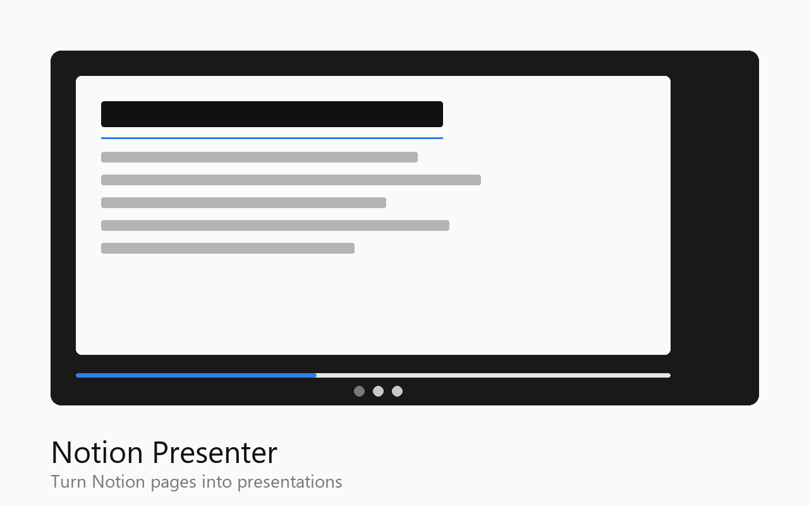

# Notion Presenter

Turn any published Notion page into a clean, full-screen presentation with one click.



## Features

- **4 split modes** — divide slides by horizontal dividers, H1, H2, or H1+H2 headings
- **4 visual themes** — Light, Dark, Notion Classic, Gradient Dark
- **H1/H2 hierarchy** — sub-heading slides always show their parent H1 for context
- **Table of Contents** — optional sidebar with clickable navigation
- **Keyboard navigation** — Arrow keys, Space, Home/End, Escape, F for fullscreen
- **Touch support** — swipe left/right on mobile devices
- **Progress bar** and slide counter
- **Preserves Notion formatting** — tables, code blocks, images, callouts, toggle blocks, numbered lists

## Installation

### From Chrome Web Store
*(coming soon)*

### Manual (Developer Mode)

1. Clone this repository:
   ```bash
   git clone https://github.com/aiscube/notion-presenter.git
   ```
2. Open `chrome://extensions/` in Chrome
3. Enable **Developer mode** (toggle in top right)
4. Click **Load unpacked** and select the cloned `notion-presenter` folder
5. The extension icon appears in your toolbar

## Usage

1. Open any published Notion page (`*.notion.site`)
2. Click the **Notion Presenter** icon in your toolbar
3. Choose split mode and theme
4. Optionally enable the Table of Contents sidebar
5. Click **Start Presentation**

### Keyboard Shortcuts

| Action         | Keys                    |
|----------------|-------------------------|
| Next slide     | `→` `Space` `PageDown`  |
| Previous slide | `←` `PageUp`            |
| First slide    | `Home`                  |
| Last slide     | `End`                   |
| Fullscreen     | `F`                     |
| Exit           | `Esc`                   |

### Touch Gestures

| Action         | Gesture      |
|----------------|--------------|
| Next slide     | Swipe left   |
| Previous slide | Swipe right  |

## Split Modes

| Mode | Description |
|------|-------------|
| **Horizontal Dividers** | Splits at `---` divider blocks (default) |
| **H1 Headings** | Each H1 heading starts a new slide |
| **H2 Headings** | Each H2/H3 heading starts a new slide |
| **H1 + H2** | Both H1 and H2 headings create new slides, with H1 shown as parent context above H2 |

## Themes

| Theme | Description |
|-------|-------------|
| **Light** | Clean white background (default) |
| **Dark** | Dark background with light text |
| **Notion Classic** | Matches Notion's native styling |
| **Gradient Dark** | Purple-blue gradient background |

## Security

This extension is built with defence-in-depth security:

### DOM Sanitisation
- All cloned Notion content passes through a two-pass sanitiser before rendering
- **Pass 1**: Removes 17 categories of dangerous elements (`<script>`, `<iframe>`, `<object>`, `<embed>`, `<form>`, `<style>`, `<template>`, `<foreignobject>`, etc.)
- **Pass 2**: Strips all `on*` event-handler attributes, `javascript:`/`vbscript:`/`data:text/html` URLs, and CSS `expression()`/`@import` injection

### Input Validation
- All parameters from popup are validated against a strict whitelist before processing
- Split mode must be one of: `divider`, `h1`, `h2`, `h1h2`
- Theme must be one of: `light`, `dark`, `notion`, `gradient`
- Invalid inputs are rejected immediately

### DOM Clobbering Protection
- All internal element lookups are scoped to the presenter overlay (`presenterOverlay.querySelector()`) rather than `document.getElementById()`, preventing malicious pages from hijacking our UI elements

### Content Security Policy
```json
"content_security_policy": {
  "extension_pages": "script-src 'self'; object-src 'none'; base-uri 'self'"
}
```
- Blocks `eval()`, inline scripts, object embeds, and base URI manipulation on extension pages

### Origin Verification
- Content script verifies it is running on a legitimate `*.notion.site` or `*.notion.so` domain before processing
- Popup double-checks the URL with a strict regex before sending messages

### Additional Protections
- TOC index bounds checking prevents out-of-range slide navigation
- Slide count capped at 500 to prevent memory exhaustion
- All user-visible text is HTML-escaped before insertion
- Touch event listeners marked `passive: true`
- Status text length capped in popup

### Privacy
- **No data collection** — everything runs locally in your browser
- **No external servers or analytics**
- **No cookies or storage**
- **Open source** — full code audit possible

## Project Structure

```
notion-presenter/
  manifest.json         # Chrome Extension Manifest V3
  content.js            # Main parser + presenter engine (injected into Notion pages)
  content.css           # Presentation themes and layout styles
  popup.html            # Extension popup UI
  popup.js              # Popup logic and validation
  privacy-policy.html   # Privacy policy for Chrome Web Store
  icons/
    icon16.png          # 16x16 toolbar icon
    icon48.png          # 48x48 extension icon
    icon128.png         # 128x128 store icon
    icon.svg            # Source SVG
  store-assets/
    promo-1280x800.png  # Chrome Web Store large promo
    promo-440x280.png   # Chrome Web Store small promo
    screenshot-1280x800.png  # Store screenshot
  tests/
    content.test.js     # Unit tests for parsing, sanitisation, and security
  STORE_LISTING.md      # Chrome Web Store listing text
  package.json          # Dev dependencies (testing)
```

## Development

### Prerequisites
- Node.js 18+
- npm 9+

### Setup
```bash
git clone https://github.com/aiscube/notion-presenter.git
cd notion-presenter
npm install
```

### Running Tests
```bash
npm test
```

Tests cover:
- DOM sanitisation (XSS prevention)
- Input validation and whitelisting
- HTML escaping
- Notion domain verification
- Slide parsing (divider mode, heading modes)
- H1/H2 hierarchy tracking
- TOC generation with escaped labels
- Edge cases (empty content, malformed DOM, extreme nesting)

### Loading in Chrome
1. Make your changes
2. Go to `chrome://extensions/`
3. Click the refresh icon on the Notion Presenter card
4. Reload the Notion page and test

## Architecture

```
[Popup] --message--> [Content Script]
                          |
                    parseNotionPage()
                          |
                    +-----------+
                    | Clone DOM |
                    +-----------+
                          |
                    sanitizeDOM()     <-- Security: Pass 1
                          |
                    splitByDivider()  or  splitByHeadings()
                          |
                    buildSlideFromBlocks()  (H1/H2 hierarchy)
                          |
                    launchPresenter()
                          |
                    +-----+------+
                    |            |
               buildTocHtml() showSlide()
                    |            |
                escapeHtml() sanitizeSlideContent()  <-- Security: Pass 2
                                 |
                           sanitizeDOM()  (defence-in-depth)
```

## Contributing

1. Fork the repository
2. Create your feature branch (`git checkout -b feature/my-feature`)
3. Run tests: `npm test`
4. Commit your changes
5. Push and open a Pull Request

## License

MIT

## Credits

Built with [Claude Code](https://claude.ai/claude-code).
